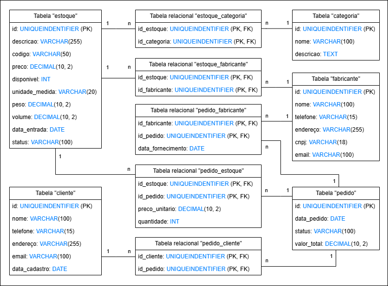

# Projeto 2 - Banco de dados
### Alunos:
Guilherme Ferreira de Souza: `22.122.061-9`  
Tainá Cunha Bueno: `22.119.025-9`

## Introdução
Este projeto foi desenvolvido para criar um sistema eficiente de gestão de peças, fabricantes e pedidos, voltado principalmente para o setor de engenharia elétrica e automação. O sistema foi projetado para gerenciar de forma integrada e organizada todas as informações relativas às peças, seus fabricantes, as categorias de produtos, os pedidos dos clientes e o estoque disponível.

## Como Executar
Foi usado o SQL Server versão 2022.  
Para executar as queries na lista de queries úteis, selecione o bloco que quer executar um de cada vez.

- Queries para criação de tabelas: `criacaoDeTabelas.sql`
- Queries para a geração de dados: `geracaoDeDados.sql`
- Queries úteis de seleção: `queriesUteis.sql`

## Diagrama Relacional

#### Nós Agradecemos!
